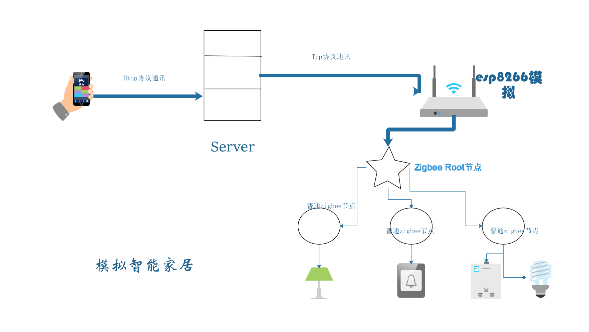

# 系统设计结构图



### 整体项目为结构图的最简实现

### android端实现
android端采用http请求和服务器建立通讯,最简单的异步post请求.
### 服务器端
服务器主要做数据转发的工作，将android发来的数据转发给esp8266,tomcat容器进行部署.

**主要逻辑**
通过ServletContextListener实现监听，当服务器开启就建立socket等待esp8266连接，将android端的http请求中数据取出写入socket连接。
### 硬件端
**主要逻辑**
cc2530通过串口和esp8266进行通讯，cc2530向串口发送AT指令使esp8266与服务器进行连接,进而实现从服务器端接收数据，cc2530主节点收到esp8266发来的数据后，发送到从节点，从节点对数据进行简单判断，执行开灯,关灯,闪烁等操作.
**代码选讲**
因为硬件结构只有2个节点，所以采用点播的通讯方式（还有广播，组网等方式不细讲）,代码是基于官方点播实例genericApp更改而来，最好百度学习一下zigbee协议栈的基本操作.

这里只讲一下esp8266和cc2530通信的部分

串口回调函数
```static void rxCB(uint8 port,uint8 event)
{   
  if ((event & (HAL_UART_RX_FULL | HAL_UART_RX_ABOUT_FULL | HAL_UART_RX_TIMEOUT)) &&
#if SERIAL_APP_LOOPBACK
      (SerialApp_TxLen < SERIAL_APP_TX_MAX))
#else
      !SerialApp_TxLen)
#endif
  { 
    uint16 len = Hal_UART_RxBufLen(HAL_UART_PORT_0);  //从串口中取出数据长度
    SerialApp_TxLen = HalUARTRead(HAL_UART_PORT_0, RxBuf,len); //读数据
    
      if ( strstr(RxBuf, "CWMODE=1") != NULL&&strstr(RxBuf, "OK") != NULL )
          {
              HalUARTWrite(HAL_UART_PORT_0,"AT+CWJAP=\"MI 6\",\"123456789q\"\r\n", strlen("AT+CWJAP=\"MI 6\",\"123456789q\"\r\n")); //连接wifi
          }
      else if ( strstr(RxBuf, "IFI GOT IP") != NULL )
          {
              HalUARTWrite(HAL_UART_PORT_0, "AT+CIPMUX=1\r\n", strlen("AT+CIPMUX=1\r\n")); //
             
          }
      else if (strstr(RxBuf, "AT+CIPMUX=1") != NULL  && strstr(RxBuf, "OK") != NULL )
          {

              HalUARTWrite(HAL_UART_PORT_0,"AT+CIPSERVER=1,8800\r\n", strlen("AT+CIPSERVER=1,8800\r\n")); 
           
          }
      else if ( strstr(RxBuf, "AT+CIPSERVER=1,8800") != NULL  && strstr(RxBuf, "OK") != NULL  )  
          {
           
              HalUARTWrite(HAL_UART_PORT_0, "AT+CIPSTART=0,\"TCP\",\"206.253.164.235\",10086\r\n", strlen("AT+CIPSTART=0,\"TCP\",\"206.253.164.235\",10086\r\n")); //端口号
          
          }
      else if (strstr(RxBuf, "ONNECT") != NULL  && strstr(RxBuf, "OK") != NULL )
          {
           
               HalUARTWrite(HAL_UART_PORT_0, "AT+CIPSEND=0,9\r\n", strlen("AT+CIPSEND=0,9\r\n")); //发送数据
          }
      else if (strstr(RxBuf, "CIPSEND=0,9") != NULL  && strstr(RxBuf, "OK") != NULL )
           {
              HalUARTWrite(HAL_UART_PORT_0, "CONN_9527\r\n", strlen("CONN_9527\r\n"));   //ȷ向服务器发送确认数据 
          }
      else if(strstr(RxBuf, "IPD,0,") != NULL)  //收到服务器的数据
      { 
        
        if(RxBuf[11]== 0x01 && RxBuf[12] == 0x00 && RxBuf[13] == 0x00)  //闪烁
        {  //
          HalUARTWrite(HAL_UART_PORT_0,&RxBuf[11], 1);
          recData[0]= 0x10;
          GenericApp_SendTheMessage();
          HalUARTWrite(HAL_UART_PORT_0,&recData[0], 1);
        }
        else if (RxBuf[11] == 0x00 && RxBuf[12] == 0x01 && RxBuf[13] == 0x00) //关灯
        {
          recData[0] = 0x20;
          GenericApp_SendTheMessage();
          HalUARTWrite(HAL_UART_PORT_0,recData, 1);
        }
        else if (RxBuf[11] == 0x00 && RxBuf[12] == 0x00 && RxBuf[13] == 0x01) //开灯
        {
          *recData = 0x30;
          GenericApp_SendTheMessage();
          HalUARTWrite(HAL_UART_PORT_0,recData, 1);
        }
      }
      SerialApp_TxLen=0;
    }
  }
  ```
#### zigbee主节点
主控芯片为cc2530,芯片是淘宝买的已经集成好，只需要提供3.3v电源就可以正常使用，串口连接一块esp8266-12的芯片用于和服务器通讯，电路没有传感器等其他功能，设计很简单,由于是手工焊接的板子所以没有细节电路图，这里就不画了简单讲解下。
##### 要点：
将TX口和esp8266的RX连接，将RX口和esp8266的TX连接,引脚接上电源（具体怎么接要参考所用的芯片引脚）,**esp8266和cc2530一定要共地**。
### zigbbe从节点

主控依旧是cc2350，3.3v供电,然后在p11口接一个ｌｅｄ灯，当然你也可以接其他口，改相应代码就好了。
